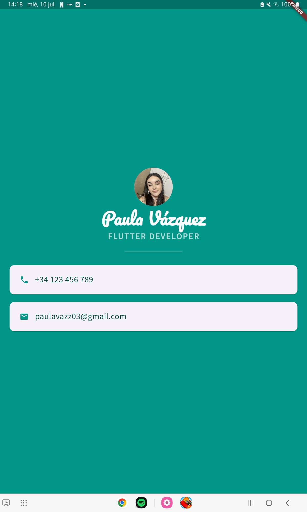

# Personal Portfolio Application

## Overview
This application is a personal portfolio developed using Flutter and Dart. It serves as a digital business card, showcasing some of my personal information such as my phone number and email. This project is part of a Flutter course and demonstrates key concepts of Flutter development.

## Features
- **Personal Information**: Displays my phone number and email address.
- **User Interface Elements**: Includes interesting elements such as icons, fonts, and images to enhance learning and user experience.
- **Simple and Intuitive Design**: The app is designed to be straightforward and easy to navigate.
## Technologies Used
- **Flutter**: A UI toolkit for building natively compiled applications for mobile, web, and desktop from a single codebase.
- **Dart**: The programming language used to develop Flutter applications.
## Screenshots

